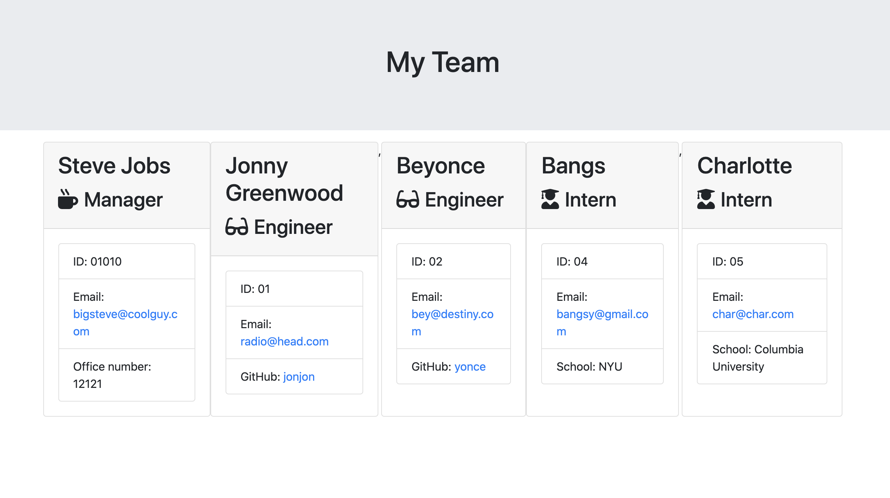

# Project Title 
Template Engine - Employee Summary

## Description
An app that allows members of a software engineering team to generate each member's info directly from the command line.

## Visuals

### Screencast Run-through

### Summary Page Example

### Table of Contents
* [Installation](#Installation)
* [Usage](#Usage)
* [License](#License)
* [Contributing](#Contributing)
* [Tests](#Tests)
* [Questions](#Questions)

## Installation
Clone this repository, then run 'npm install' to install node modules. 

## Usage
Run 'node app.js' to start creating an employee summary page.

## License
MIT License selected. Click the badge above for further details.

## Contributing
Pull requests are welcome. For major changes, please open an issue first to discuss what you would like to change. Please make sure to update tests as appropriate.

## Tests
To test, input 'npm run test' in the command-line.

## Questions

- - -
© 2020 Rocco Losito. All Rights Reserved.
